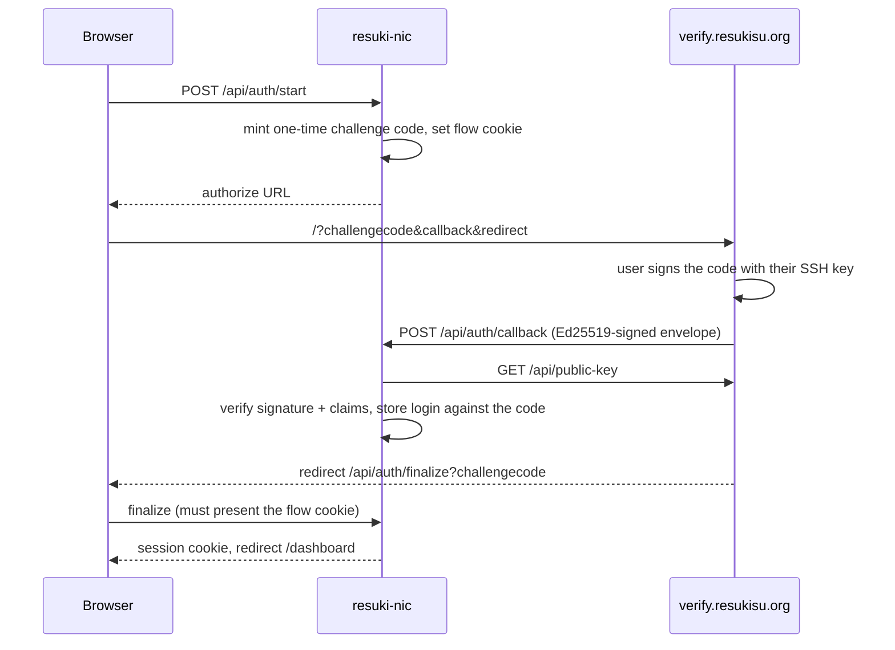

# resuki-nic

Personal domains under `resukisu.org`.

Users sign in with their GitHub SSH key through the verifier at
<https://verify.resukisu.org> (source: <https://github.com/originalFactor/ghssh>),
then register **one** personal domain:

| Suffix | Who | DNS |
| --- | --- | --- |
| `*.verified.resukisu.org` | any verified GitHub account | NS delegation created via the Cloudflare API |
| `*.contrib.resukisu.org` | contributors of `Baka-SU/BakaSU` (configurable) | same |

The app never holds DNS data — it creates the delegation records in the parent
zone (`resukisu.org`) and hands authority to nameservers the user chooses.

Both suffixes live in that single zone: a registration is a set of NS records
for `<label>.<suffix>.resukisu.org`. Splitting them into their own zones would
require Cloudflare's **Enterprise-only** "subdomain setup", so it is not
supported by design.

## How sign-in works



Security properties worth keeping:

- The callback is **server-to-server**; it is not authenticated by a browser
  session. Trust comes from the Ed25519 signature over the signed payload
  (checked against the verifier's *published* key, never the key in the
  envelope) plus the single-use challenge code this app issued.
- The challenge code alone cannot mint a session: `/api/auth/finalize`
  additionally requires the `rn_flow` cookie set in the browser that started
  the login.
- Verified logins are consumed atomically (`GETDEL`/compare-and-set), so a
  replayed callback cannot sign anyone in twice.
- Session cookies are HMAC-SHA256 signed and `httpOnly`.

## API

| Route | Purpose |
| --- | --- |
| `POST /api/auth/start` | mint a challenge, return the verifier URL |
| `POST /api/auth/callback` | verifier → app; verifies the signed envelope |
| `GET /api/auth/finalize` | browser return leg; sets the session cookie |
| `GET /api/auth/session` | current session + enabled suffixes |
| `POST /api/auth/logout` | clear cookies |
| `GET /api/domains` | domains owned by the caller |
| `POST /api/domains` | register (NS + glue) |
| `GET /api/domains/check?label=&suffix=` | live availability/validation |
| `DELETE /api/domains/delete?fqdn=` | remove a delegation |
| `GET /api/health` | configuration/readiness report |

## Registration rules

- One domain **per account per zone**.
- Labels: `a-z0-9-`, no leading/trailing hyphen, ≤ 63 chars, reserved words
  (`www`, `api`, `mail`, `ns`, …) rejected.
- 1–7 nameservers. Nameservers inside the delegated name require glue
  addresses (A/AAAA), because the parent zone cannot resolve them otherwise.
- A name already delegated in public DNS is refused even if our zones know
  nothing about it — availability probes are not limited to our own records.
- NS records are created first; any failure rolls back every record the call
  created, and the error says whether the rollback was complete.

## Configuration

Copy `.env.example` to `.env.local` and fill it in. Required in production:
`SESSION_SECRET`, a KV store, and `CLOUDFLARE_API_TOKEN`. `GITHUB_TOKEN` is
strongly recommended (60 → 5000 requests/hour for contributor checks).

### Cloudflare token

Needs, on the parent zone: `Zone → DNS → Edit` and `Zone → Zone → Read`.
Create it at <https://dash.cloudflare.com/profile/api-tokens>.

Set `CF_ZONE` if the parent is not `resukisu.org`. Nothing else has to exist
inside the zone beforehand — the `verified` and `contrib` subdomains appear as
plain NS record sets, and Cloudflare serves the referral automatically.

### KV store

Vercel KV injects `KV_REST_API_URL`/`KV_REST_API_TOKEN`; the Upstash
integration injects `UPSTASH_REDIS_REST_*`. Either pair works.

## Local development

```bash
pnpm install
pnpm dev                      # http://localhost:3000
pnpm typecheck && pnpm lint
pnpm smoke                    # full flow against local stubs
```

`pnpm smoke` is self-contained: it boots `scripts/stub-services.mjs` (verifier
key and page + Cloudflare and GitHub API subsets), `scripts/stub-dns.mjs` (NS
answers), starts the app with every upstream pointed at those stubs, and runs
50 assertions over the whole flow:

- forged and replayed callbacks, and envelopes for unissued challenges
- flow-cookie binding (a leaked challenge code alone cannot mint a session)
- origin consistency between the callback/redirect URLs, redirects and cookies
- auth guards on every domain route
- label/nameserver validation, including in-zone nameservers needing glue
- registration creating NS + glue records, one domain per account per zone
- names already delegated outside our zones
- ownership checks, contributor gating, deletion, and upstream cleanup

It needs no `.env.local` and never contacts Cloudflare, GitHub or the live
verifier. `pnpm dev` against the real services only needs the variables in
`.env.example`.

## Deploying to Vercel

The repo is pushed to `github.com/originalFactor/resuki-nic`, so the shortest
path is git integration:

1. Import the repository into Vercel (framework preset: Next.js; no build
   settings to change).
2. Add environment variables from `.env.example` (production scope). Generate
   `SESSION_SECRET` with `openssl rand -base64 48`, install a KV store, and
   paste the Cloudflare token.
3. Set `APP_ORIGIN` to the production URL so the callback/redirect URLs handed
   to the verifier, and the cookies, all agree on one origin.
4. Ensure the parent zone (`resukisu.org`) is in the Cloudflare account and the
   token has `DNS:Edit` + `Zone:Read` on it.
5. Deploy; every later push to `main` redeploys.

Without git integration, the CLI works too:

```bash
pnpm dlx vercel link --repo            # links to the Vercel project
pnpm dlx vercel env add SESSION_SECRET production
pnpm dlx vercel --prod                 # or omit --prod for a preview
```

`pnpm dlx vercel deploy --help` lists the rest; `vercel env ls` audits what is
configured.

No DNS records need to exist before the first registration, and the parent
zone's own nameservers do not change: a delegated name only needs the NS
records this app writes.

Serverless functions default to the Node.js runtime; `node:dns` and
`node:crypto` are used directly, which is why the app is pinned to Node rather
than Edge.

### Verifier allow-list

The verifier refuses callbacks to hosts it cannot resolve to a public address
(verified by probing the live endpoint). A public Vercel URL resolves fine. If
the verifier runs with `EXTERNAL_CALLBACK_ALLOWED_HOSTS` set, add the
production host there.
